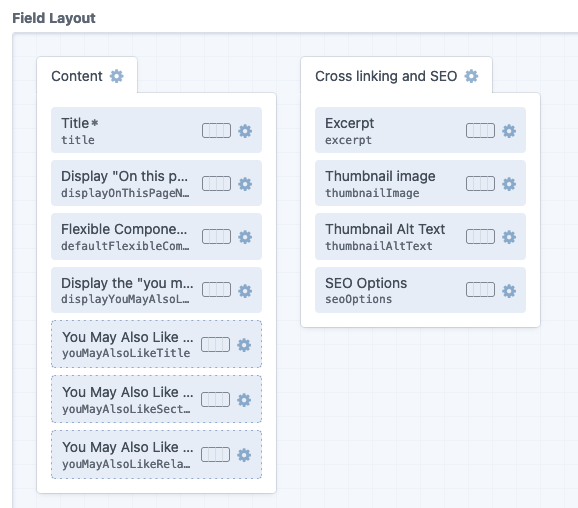
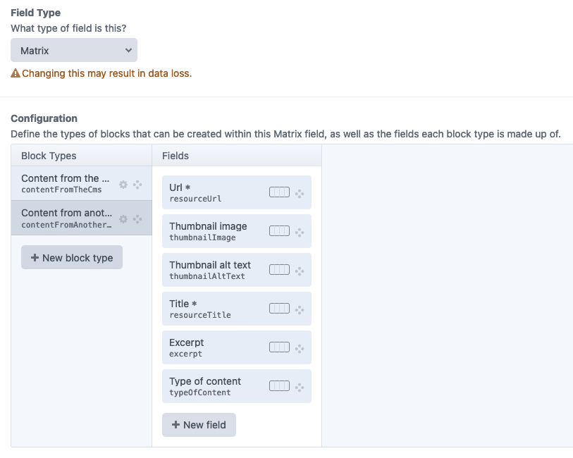

# Writing GraphQL to retrieve content from CraftCMS

## Using GraphiQL to help build GraphQL

It's recommended to use the interactive in-browser GraphQL IDE, [GraphiQL](https://github.com/graphql/graphiql), 
to help build your GraphQL queries.

This is available in CraftCMS. Login to the W3C CMS, go to
_GraphQL > GraphiQL_ and make sure you select the _Reading schema_ (this is the API schema all pages use by default on 
the front-end app). 

### Testing queries
Write your query in the left-hand window and select the _Execute Query_ button (or press _Control + Enter_) to run your query. 


The retrieved data will then appear in JSON format in the right-hand window, or you'll get a GraphQL error response 
detailing what went wrong.

### Fragments
If you are using fragments copy these into the query window to test these (below your main query).

### Variables
If you are using variables copy these into the _Query Variables_ window as JSON, e.g.

```json
{
  "uri": "landing-page/w3c-mission-default",
  "siteId": 1
}
```

### Schema explorer
You can select _Explorer_ to view a list of all fields available (there are a lot!). 

### Schema documentation
You can select _Docs_ to open up interactive API documentation. You can search for a field or object and it will 
return information setup in the GraphQL schema. For example, searching for _defaultFlexibleComponents_ returns the
GraphQL object `defaultFlexibleComponents_MatrixField` and the child objects available within it.

## Working out what content fields to retrieve

There are a lot of content fields exposed in GraphQL. The trickiest thing in GraphQL is working out what fields to select 
and the exact format to use in GraphQL.

You can refer to the planning doc [W3C Content Types + Fields](https://docs.google.com/spreadsheets/d/10p_TzKw2OPz80feWzRIN2bbpqYJeXXADnDT93xgKq2Y/view)
to help confirm the different fields for each content type. You can also review the exact setup in CraftCMS.

To do this login to the CMS and go to _Settings > Content > Sections_. Find the section you are interested in and select 
the _entry type_ you want to view content fields for. This displays the content configurator and lists all custom fields 
for that entry type.

This will display a list of fields in the _Field Layout_ section. The field handle name may be concatenated, in which case 
you can hover over the field name to view the full name or just enter the first few characters to search for the 
field handle name in the schema documentation in GraphiQL.



_**Please note:** we use configuration (in version control) to setup CraftCMS content types, entry types and fields. Please do not make changes
in the CMS on dev or staging. Any changes should be made on your local dev and exported. For more see [Craft configuration](https://github.com/w3c/w3c-website-craft/blob/main/docs/craft_configuration.md)._

### Flexible components

We use the _Matrix_ field type to store flexible components. In CraftCMS a matrix field can contain 
any number of predefined blocks in any order. 

To see what blocks are supported, and what fields each block has, you can view child content fields by going to 
_Settings > Content > Content Fields_. Search for the _block handle_ you want to inspect, 
for example _youMayAlsoLikeRelatedEntries_ to view the "You may also like" related content entries.

Once selected, you'll see the blocks this component contains in the _Configuration_ section. By selecting a block you'll
see the child fields this block contains.



Again, you can refer back to GraphiQL to help confirm the field names and where to place these in your GraphQL query.

When selecting fields for matrix blocks it's useful to include the `typeHandle` field which returns the CraftCMS 
handle. This provides a simple way to detect what type of flexible component is being returned. 
GraphQL's internal handle `__typename` is also available, however, this is a lot longer and more verbose than the 
CraftCMS handle. For example, compare these for the standard text component:

```json
  "typeHandle": "textComponent",
  "__typename": "defaultFlexibleComponents_textComponent_BlockType",
```

Sometimes it's also helpful to edit a page of the entry type you are building GraphQL query so you can 
see what content can be entered (which you then need to retrieve in GraphQL).

We have a convention to setup flexible components as a fragment, to keep GraphQL more organised. E.g.

```graphql
fragment defaultFlexibleComponents on defaultFlexibleComponents_MatrixField {
    # define fields to select here
}
```

You can then include the fragment in your main GraphQL query as so, making sure you order blocks by the `sortOrder` field:

```graphql
defaultFlexibleComponents(orderBy: "sortOrder") {
    ...defaultFlexibleComponents
}
```

The above example uses the [defaultFlexibleComponents](../../src/Query/CraftCMS/graphql/fragments/defaultFlexibleComponents.graphql) fragment.

Find out more on building GraphQL queries for [Matrix flexible component content fields](matrix-flexible-components.md). 

## Writing GraphQL

Once you know the fields you wish to retrieve you can start typing these in GraphiQL and it will auto-complete
as you type. You can also refer to the schema explorer or schema documentation to confirm the field names.

## Where to save GraphQL queries

Given most GraphQL queries are pretty complex, it's simpler to save these as text files (with the extension `.graphql`) in:

* `src/Query/CraftCMS/graphql/`

We aim to have one GraphQL query to grab the current page content (e.g. display a page, display a news listing) and one 
query to grab any global content that is shared across pages (currently just global navigation).

Where possible, we split out complex GraphQL into fragments. We currently use fragments to for flexible components 
(the matrix field in CraftCMS). Fragments are stored in:

* `src/Query/CraftCMS/graphql/fragments/`

## Docs

* [Intro to GraphQL](https://graphql.org/learn/)
* [CraftCMS GraphQL](https://craftcms.com/docs/3.x/graphql.html#), direct link to specific queries below:
  * [assets](https://craftcms.com/docs/3.x/graphql.html#the-assets-query)
  * [assetCount](https://craftcms.com/docs/3.x/graphql.html#the-assetcount-query)
  * [asset](https://craftcms.com/docs/3.x/graphql.html#the-asset-query)
  * [entries](https://craftcms.com/docs/3.x/graphql.html#the-entries-query)
  * [entryCount](https://craftcms.com/docs/3.x/graphql.html#the-entrycount-query)
  * [entry](https://craftcms.com/docs/3.x/graphql.html#the-entry-query) 
