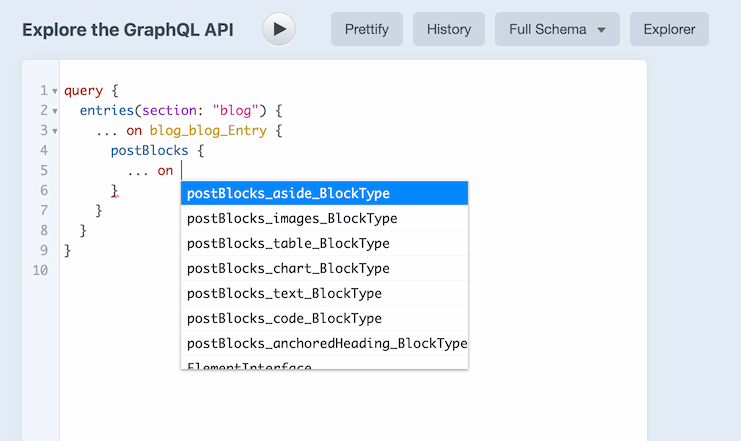
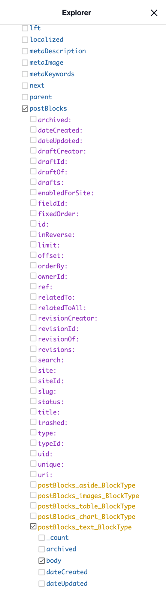
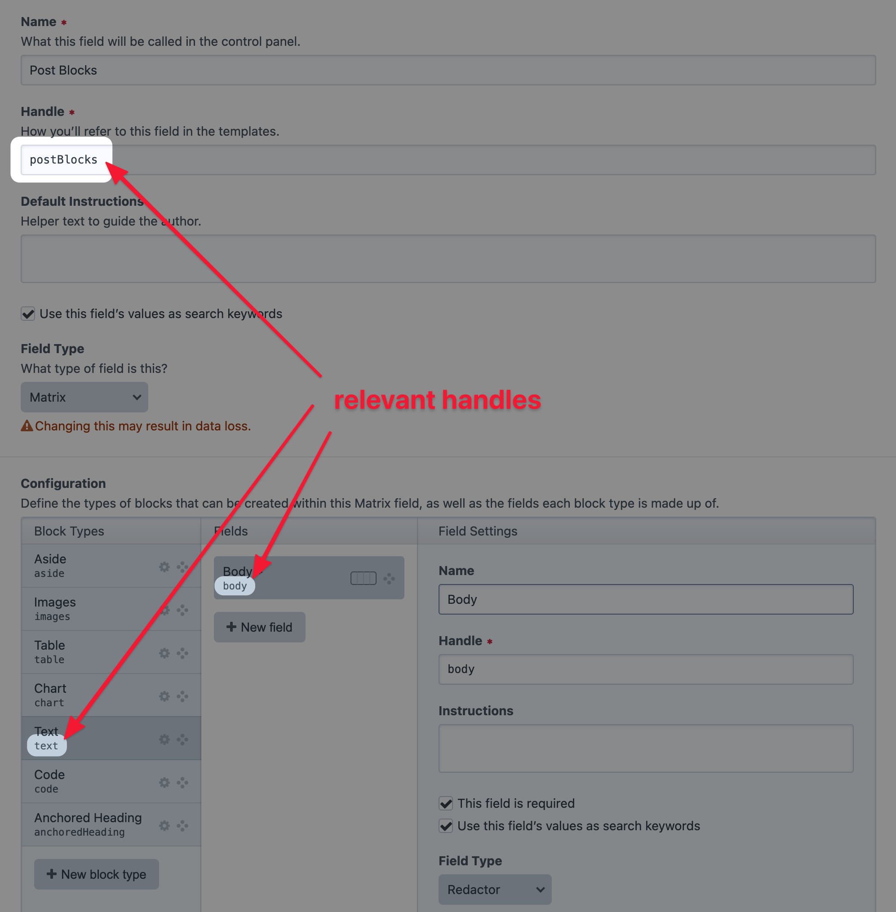

# Matrix: flexible components

_Information from Craft Support:_

If you’re looking to get content from a Rich Text field within a Matrix block, you'll need the entry type, Matrix field
handle, Matrix block type, and Matrix block field handle for the query like this:

```graphql
query {
    entries(section: "blog") {
    ... on blog_blog_Entry {
      postBlocks {
        ... on postBlocks_text_BlockType {
          body
        }
      }
    }
  }
}
```

This is for a blog section entry with a postBlocks Matrix field with a body Rich Text field that’s in a text block type.

Each of these bits and pieces should be discoverable via autocomplete or the Explorer pane in Craft’s GraphiQL interface.





This is what that Matrix field’s configuration looks like in the Craft control panel.

